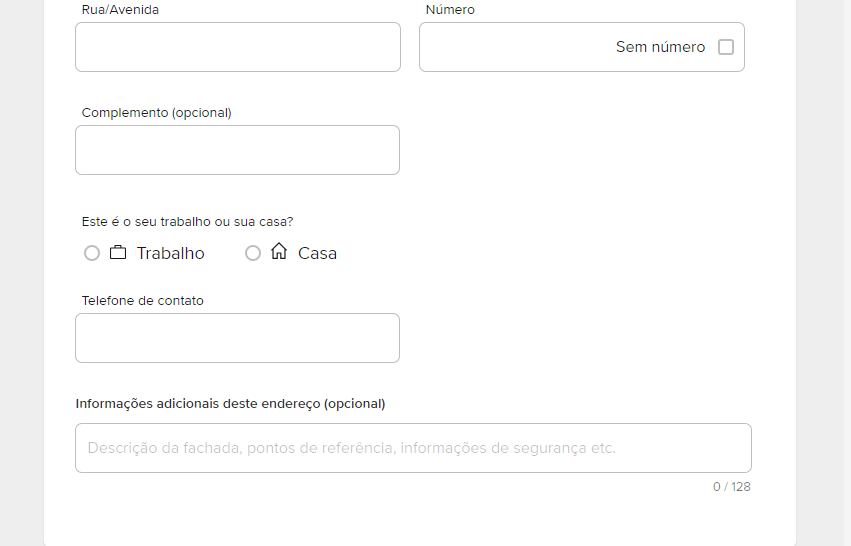
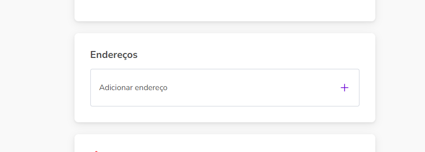
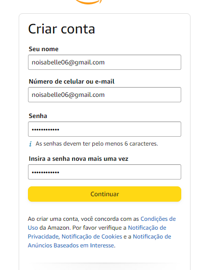

# Índice
[Projeto - ](#projeto---portifolio-para-escrita-do-readme)  
[Descrição](#descri%C3%A7%C3%A3o)  
[Funcionalidades](#funcionalidades)  
[Tecnologias ultilizadas](#tecnologias-ultilizadas)    
[Fontes consultadas](#fontes-consultadas)  
[Autores](#autores)  

# Projeto - 
Identificar 3 sites, ver as diferenças e organização do site e depois adcionar ao programa com  com link de navegação configurado e com os recursos implementados funcionando. Por exemplo, ao digitar o CEP, ele deverá preencher os campos corretamente.
 
   * 
    
   
  https://www.mercadolivre.com.br/gz/checkout/cart/buying/b2671a2f733946158cd68484c2aebf45/addressFloxStepShippingMethodsaddressFlox
   
  <strong> Diferença visualizada </strong>
   
  O site "Mercado livre" tem uma pergunta sobre o ponto de entrega ser no trabalho ou na casa pois o mercado livre é muito utilizado por empresas
  
  
   

 *  
   
  <strong> Diferença visualizada </strong>
   
  O site "OLX" apresenta um novo endereço pois trabalha não só você comprando,mais vendendo tambem
  
 

 *  
https://www.amazon.com.br/?&tag=hydrbrabk-20&ref=pd_sl_7rwd1q78df_e&adgrpid=79547423725&hvpone=&hvptwo=&hvadid=476995574390&hvpos=&hvnetw=g&hvrand=18072714701923538017&hvqmt=e&hvdev=c&hvdvcmdl=&hvlocint=&hvlocphy=1001637&hvtargid=kwd-10573980&hydadcr=26346_11604061
   
  <strong> Diferença visualizada </strong>
   
  O site "Amazon" é internacional e muito utilizado sendo assim deve priorisar a segurança dos seus consumidores por isso precisa de uma confirmação da senha
  
 

<strong>Disciplina:</strong> Programação Web I.  
<strong>Professor:</strong>  Leonardo Santiago Sidon da Rocha.  

## 📱Tecnologias utilizadas
 *   
  javascript  
 *  
  HTML 
 *  
  CSS 
  

## 🔠Fontes consultadas
  https://developer.mozilla.org/pt-BR/docs/Web/HTML/Element/option
  https://velhobit.com.br/programacao/carregando-cep-cidades-dinamicamente.html
  https://www.guj.com.br/t/buscar-cep-de-forma-automatica-html5/401658/2
  
  
## ✒️Autores
  Isabelle Nascimento de Oliveira  
